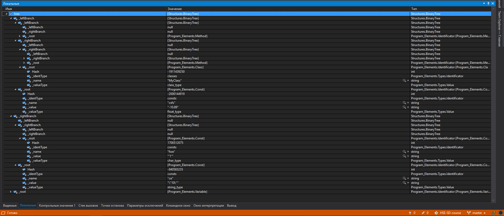

# HSE-SD-course
Репозиторий содержит сборник программ, написанных во время прохождения курса от НИУ ВШЭ по конструированию программного обеспечения

# Tree identification
Программа, которая преобразовывает файл программы в двоичное дерево содержащее основные элементы кода (классы, методы с входными данными, переменные и т.д.)

## Пример построенного дерева:

## Автор

* **Максим Шипицин** - *Разработка проекта и требований* - [ IngeniariusSoftware](https://github.com/IngeniariusSoftware)

## License

This project is licensed under the MIT License - see the [LICENSE.md](LICENSE.md) file for details
